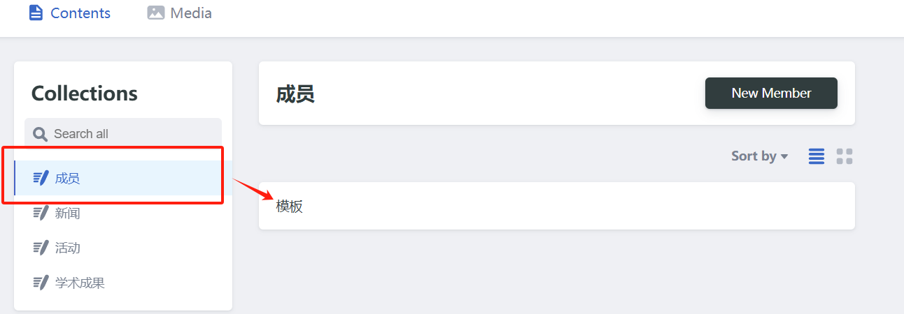

# 可信AI实验室

主页：[tic-lab.club](https://tic-lab.club)

## 添加：成员/活动/新闻/学术成果

下面以添加 `成员` 为例

### 1. 进入后台管理页面 [https://tic-lab.netlify.app/admin/](https://tic-lab.netlify.app/admin/)

注册一个账号或者使用github登录：

### 2. 选择 `模板`

进入到主界面后，选择模板：

进入表单页面，选择 `duplicate` 复制一份后，开始填写你自己的信息吧~

### 3. 填写完成后，选择 `save`即可。系统会自动提交PR，等待管理员合并

### 4. `save`之后显示如下界面，**不要点 `Publish` !!!**

