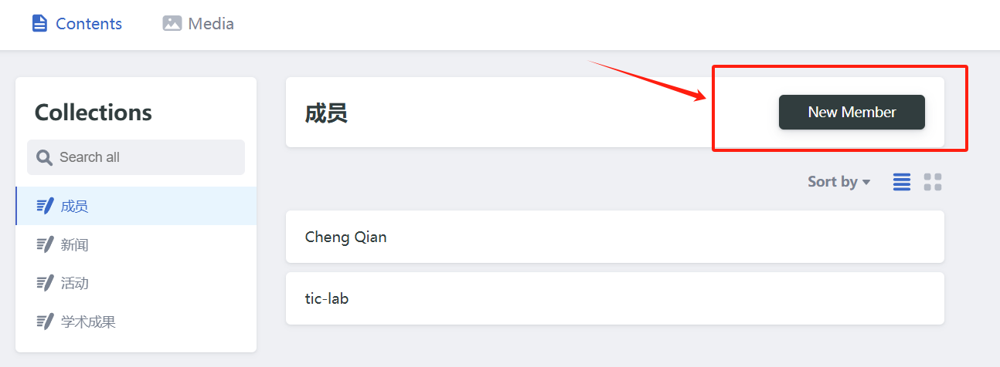

# 可信AI实验室

主页：[www.tic-lab.club](https://www.tic-lab.club)

## 添加：成员/活动/新闻/学术成果

下面以添加 `成员` 为例

### 1. 进入后台管理页面 [https://www.tic-lab.club/admin](https://www.tic-lab.club/admin)

注册一个账号或者使用github登录：

### 2. `New Member`

进入到主界面后，选择`New Member`：

- 姓名和头像是必须填的，其他信息可以不填。
- 上传头像时，请把文件名改为`avatar.jpg`或者`avatar.png`，然后再上传。

### 3. 填写(修改)完成后，选择`save`即可。系统会自动提交PR到github仓库，等待管理员合并即可

### 4. `save`之后显示如下界面，**请不要点 `Publish` !!!**

