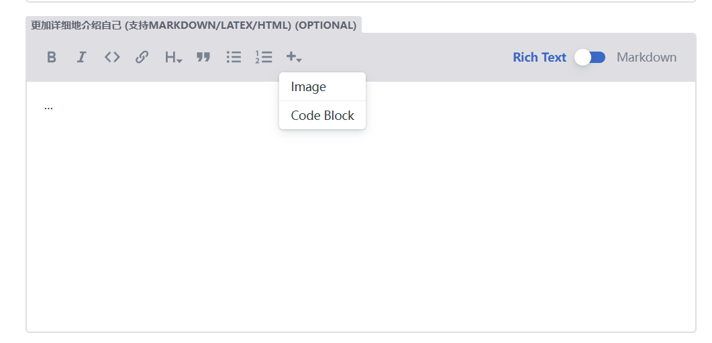

# 可信AI实验室 [www.tic-lab.club](https://www.tic-lab.club)

## 信息录入（成员/活动/新闻/学术成果/研究方向）

信息管理页面：[www.tic-lab.club/admin]() 。github账号登录 or 点击`sign up`注册。

## 录入成员为例

### New Member

- `姓名`、`头像`和`成员分组`是必须填的，其他信息可以不填。
- 上传头像时，请把文件名改为 `avatar.jpg`或者 `avatar.png`，然后再上传。

### Body块
在`成员/活动/新闻/学术成果/研究方向`的界面中都会存在一个很大的`Body块`，让你自由发挥。

- 点击右侧滑块，在`Rich Text`和`Markdown`模式之间切换。

- 当处于`Rich Text`模式时，你可以点击快速工具栏中各种按钮来实现`加粗`、`斜体`、`插入图片`等功能。

- 当处于`Markdown`模式时，你可以直接输入markdown语法来编辑你的个人简介。如果你不熟悉markdown语法，可以参考下面的链接：
    - [markdown语法](https://www.markdownguide.org/basic-syntax/)

### 填写(修改)完成后，点击`save`，请等待几秒。系统会自动提交PR到github仓库，等待管理员合并即可。`Save`完成后请不要点 `Publish`。

